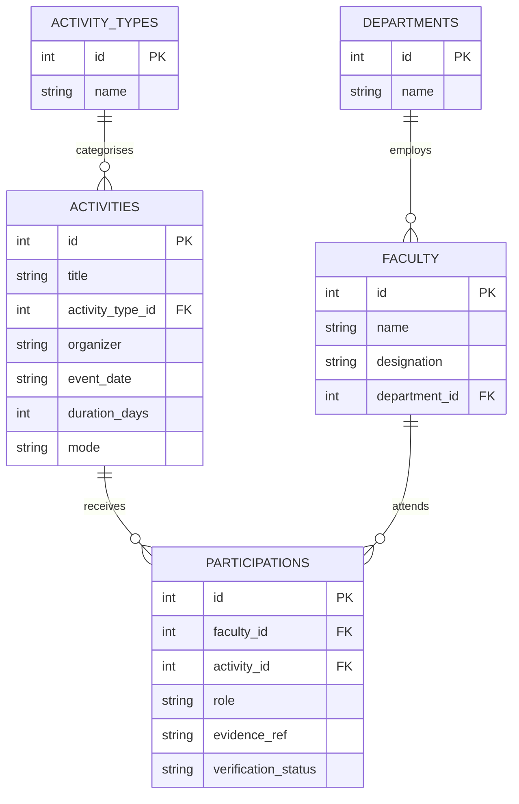

# ER Model — V09 Faculty Development & Participation

## Diagram

## The V09 design challenge — our call

This one overlaps a lot with V04 (student events), so early on we had to figure out:should Event/Activity be one shared table for everyone,or does each participant type get its own thing?

We went with `activities` as a shared master table — it just holds the details of the event itself (title,type,organizer,date,mode). Then `participations` is where the faculty-specific stuff lives: which faculty member attended, what role they played, their evidence, and whether it's been verified.

We thought about doing one big generic participation table for both students and faculty, using something like `participant_id` + `participant_type` to tell them apart. It sounded neat on paper but it breaks foreign keys... you can't point one column at two different tables and still have the database enforce integrity properly. Since this whole system exists to back up accreditation claims, we didn't want to risk that. A clean FK beats a clever shortcut here.

We also didn't want to just flatten everything into one wide table with the event details repeated on every row. That means if 30 faculty attend the same workshop, you'd have the organizer, date and mode copied 30 times — and the moment someone updates one row and not the others, your data's out of sync. Keeping activities separate avoids that entirely.

One more thing: the evidence (certificate, proof of attendance, whatever) lives on the `participations` row, not on `activities`. That's because the evidence is proving that *this specific person* was there — it's not a property of the event itself, it's a property of their attendance.

So if we end up adding students later, the plan is to just add a `student_participations` table that also points back to `activities`. That way faculty's foreign keys never have to change, and we're not retrofitting anything.
