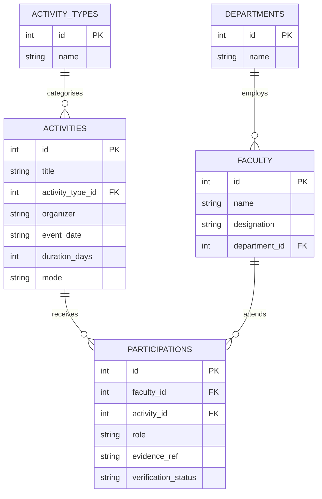

# ER Model — V09 Faculty Development & Participation

## Diagram

## The V09 design challenge — our call

This problem deliberately overlaps with V04 (student events). We had to decide whether Event/Activity is one shared core entity or kept separate per participant type.

**What we chose:** `activities` is a reusable master table describing the event itself (title, type, organizer, date, mode). The `participations` table is the faculty-specific link that ties a faculty member to an activity and carries their role, evidence and verification status.

**Why not one giant shared participation table for both students and faculty?** A generic `participant_id` + `participant_type` design can't have clean foreign keys to two different tables at once, so we would lose referential integrity. For an accreditation tool, integrity matters more than clever reuse.

**Why not a flat table?** Flattening would copy the activity details (organizer, date, mode) once per attendee, which is wasteful and invites inconsistency.

**Evidence sits on participation, not activity:** the certificate proves a specific person attended, so `evidence_ref` belongs on the participation row.

If student participation were added later, we would create a `student_participations` table pointing at the same `activities` table rather than breaking the faculty foreign keys.
